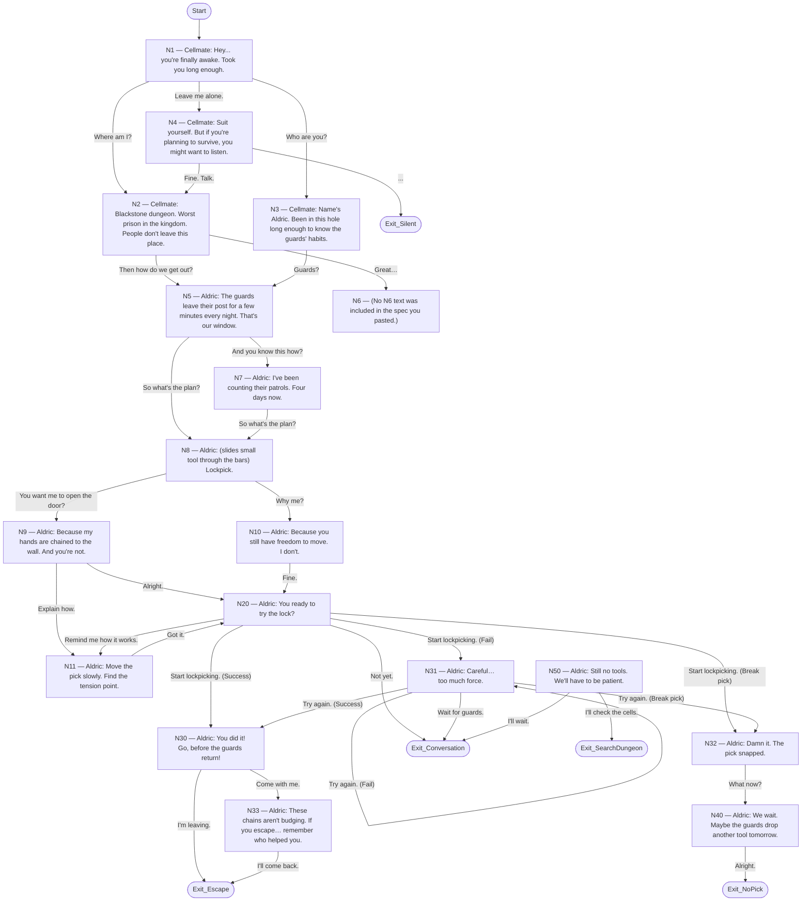

# Cellmate Dialogue (Graph View)

Open this file and use **Markdown Preview** in Cursor to view the graph.

```mermaid
flowchart TD
  %% Dialogue nodes (full text) + options (edge labels)
  N1["N1 — Cellmate: Hey... you're finally awake. Took you long enough."]
  N2["N2 — Cellmate: Blackstone dungeon. Worst prison in the kingdom. People don't leave this place."]
  N3["N3 — Cellmate: Name's Aldric. Been in this hole long enough to know the guards' habits."]
  N4["N4 — Cellmate: Suit yourself. But if you're planning to survive, you might want to listen."]

  N5["N5 — Aldric: The guards leave their post for a few minutes every night. That's our window."]
  N6["N6 — (No N6 text was included in the spec you pasted.)"]
  N7["N7 — Aldric: I've been counting their patrols. Four days now."]
  N8["N8 — Aldric: (slides small tool through the bars) Lockpick."]
  N9["N9 — Aldric: Because my hands are chained to the wall. And you're not."]
  N10["N10 — Aldric: Because you still have freedom to move. I don't."]
  N11["N11 — Aldric: Move the pick slowly. Find the tension point."]

  N20["N20 — Aldric: You ready to try the lock?"]
  N30["N30 — Aldric: You did it! Go, before the guards return!"]
  N33["N33 — Aldric: These chains aren't budging. If you escape… remember who helped you."]
  N31["N31 — Aldric: Careful… too much force."]
  N32["N32 — Aldric: Damn it. The pick snapped."]
  N40["N40 — Aldric: We wait. Maybe the guards drop another tool tomorrow."]
  N50["N50 — Aldric: Still no tools. We'll have to be patient."]

  %% Exit endpoints (no events/functions, just where the dialogue goes)
  Exit_Silent(["Exit_Silent"])
  Exit_Conversation(["Exit_Conversation"])
  Exit_Escape(["Exit_Escape"])
  Exit_NoPick(["Exit_NoPick"])
  Exit_SearchDungeon(["Exit_SearchDungeon"])

  START([Start]) --> N1
  N1 -->|"Where am I?"| N2
  N1 -->|"Who are you?"| N3
  N1 -->|"Leave me alone."| N4

  N2 -->|"Then how do we get out?"| N5
  N2 -->|"Great…"| N6

  N3 -->|"Guards?"| N5

  N4 -->|"Fine. Talk."| N2
  N4 -->|"..."| Exit_Silent

  N5 -->|"And you know this how?"| N7
  N5 -->|"So what's the plan?"| N8

  N7 -->|"So what's the plan?"| N8

  N8 -->|"You want me to open the door?"| N9
  N8 -->|"Why me?"| N10

  N9 -->|"Alright."| N20
  N9 -->|"Explain how."| N11

  N10 -->|"Fine."| N20

  N11 -->|"Got it."| N20

  %% Lockpicking outcomes represented as link labels (no event node)
  N20 -->|"Start lockpicking. (Success)"| N30
  N20 -->|"Start lockpicking. (Fail)"| N31
  N20 -->|"Start lockpicking. (Break pick)"| N32
  N20 -->|"Remind me how it works."| N11
  N20 -->|"Not yet."| Exit_Conversation

  N30 -->|"Come with me."| N33
  N30 -->|"I'm leaving."| Exit_Escape

  N33 -->|"I'll come back."| Exit_Escape

  N31 -->|"Try again. (Success)"| N30
  N31 -->|"Try again. (Fail)"| N31
  N31 -->|"Try again. (Break pick)"| N32
  N31 -->|"Wait for guards."| Exit_Conversation

  N32 -->|"What now?"| N40
  N40 -->|"Alright."| Exit_NoPick

  N50 -->|"I'll check the cells."| Exit_SearchDungeon
  N50 -->|"I'll wait."| Exit_Conversation
```

